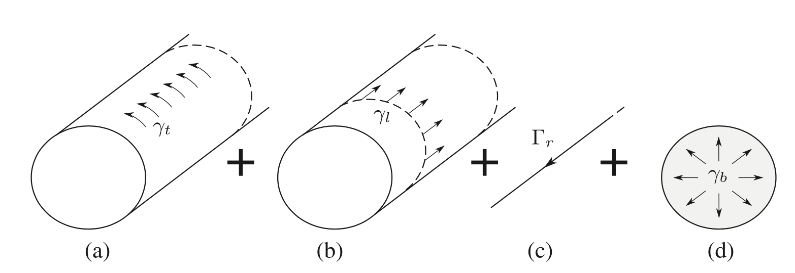
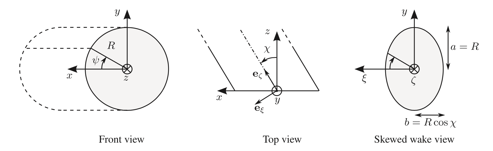
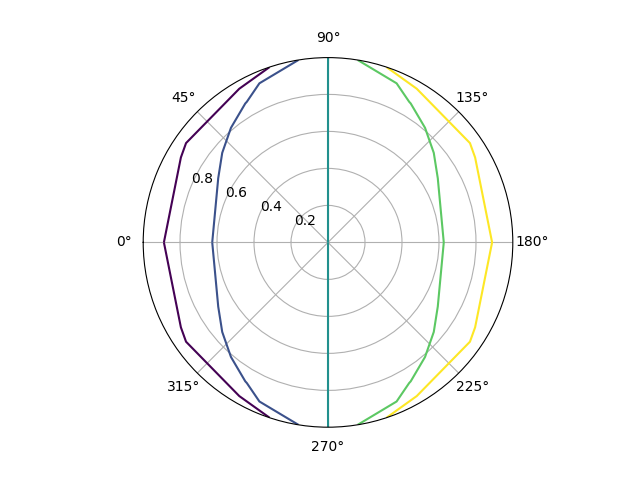
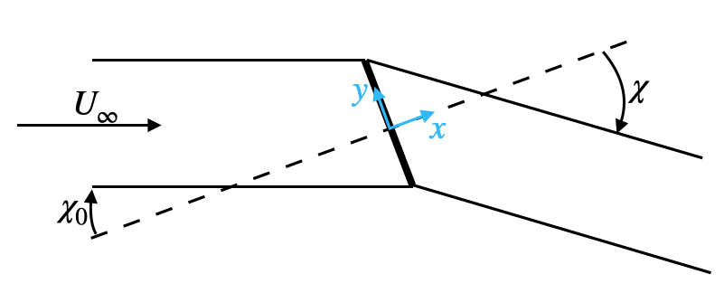
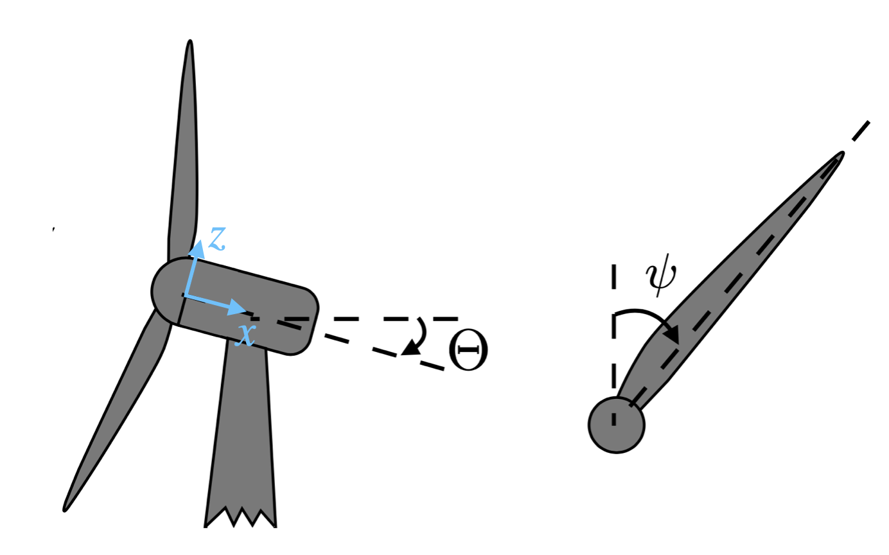

# Cylinder wake model

We explain how the cylinder wake model is implemented, and we go over the related modifications in the BEM equations.

The purpose of this model is to account for radial flow components, and wake skewness. It can be seen as a generalization of other skewed inflow models such as Pitt & Peters, etc. It is based on a cylindrical representation of the wake, as proposed in [Branlard2015] and [Branlard2016]. As argued in [Crawford2006] and [McWilliams2011], the so-derived BEM has improved accuracy for cases with precone and yaw.


## Induced velocities

!!! note
    For details on this section, see \[Branlard2016\]. Illustrations from this section are also mostly taken from there.

### Principle 

The wake geometry of the wake is assumed fixed. It is composed of a semi-inifinite outer cylindrical vortex sheet of radius `R`, a disk vortex sheet at the location of the rotor and a semi-infinite root vortex filament. The disk has a purely radial vorticity component, and the outer cylindrical sheet has two separate components: axial and tangential. 
The vorticity/circulation in those elements is assumed uniformly constant.

The indice ``r`` refers to the root axial vorticity, ``b`` to the bound vorticity on the disk, ``t`` to the tangential vorticity in the outer sheet, and ``l`` to the axial/longitudinal vorticity in the outer sheet.



All the vortex instensity components in the different wake objects are related, see next section. For now, let us assume that they are all linearly dependant on ``\gamma_t``. This will be convenient since the usual result from the Biot-Savart law is ``u_{x_0} = \gamma_t / 2``, where ``u_{x_0}`` is the velocity induced at the edge of a straight circular cylinder with uniform tangential vorticity.

To include yaw, we allow the wake to be skewed by an angle ``\chi`` with respect to the rotor frame of reference. Mind the coordinate system attached to the rotor, which does not follow wind turbine conventions!



In those conditions, we can compute the velocity induced by each of the vortex component (for a given ``\gamma_t``) from each object on a point located on the rotor disk.  This comes down to numerically integrate [Branlard2016, eq.5-8], which we do with Gauss-Legendre quadrature.


For example, we set ``\chi = 30^o``, ``\gamma_t = -1``. The axial velocity (z) induced by the tangential component of the outer vorticity cylinder (t) is ``u_{z,t}``:




The radial and tangential velocities induced by the tangential component of the outer vorticity cylinder (resp. ``u_{r,t}``, ``u_{\psi,t}``) are also shown:


Similarly, the axial velocity induced by the root vortex ``u_{z,r}`` (assuming ``\Gamma_{r} = -1``):


!!! note
    The dominating  wake component on the induced velocities are those from the tangential vorticity in the outer cylinder, and the axial vorticity in the root vortex, see [Branlard2016, sect.4].

### Expressions of the induced velocities from the respective wake components

From here on, we resume with standard wind-turbine conventions regarding frame of references.

Crucially, we still assume the independance of annular sections on the rotor. A formal motivation for this is given in [Branlard2015, sect.4.3] for the case of the straight cylinder wake model. In practice this means the following:
every anular section has an assocaited bound vorticity ``\gamma_b`` that corresponds to the circulation of the blades at that location. Neglecting the circulation of all the other anular sections, the vorticity in all other wake components may be expressed as a function of the bound vorticity, by the Kelvin theorem (circulation is conserved). We thus have (see also [Branlard2016, 2.3]):
```math
\Gamma_r = -2\pi r \gamma_b 
```
```math
\gamma_l = -\frac{\Gamma_r}{2\pi R}
```
```math
\gamma_t = -\frac{\Gamma_r}{h / cos(\chi)}
```
where ``h`` is the pitch of the helix formed by the tangential and axial components in the outer vortex sheet. At high TSR (``\lambda``), the latter can be evaluated as ``h=\frac{\pi R}{\lambda} (1 + \sqrt{1-C_T})`` (see [Branlard2015, sect.4] and refs therein).

As mentioned before, we rather express the various vorticity/circulations as a function of ``\gamma_t``:
```math
\Gamma_r = -\gamma_t \frac{h}{\cos\chi} 
```
```math
\gamma_l = \frac{\gamma_t}{2\pi R} \frac{h}{\cos\chi} 
```
```math
\gamma_b = \frac{\gamma_t}{2\pi r} \frac{h}{\cos\chi} 
```
Note that all are linear in ``\gamma_t``.

!!! warning
    In the following, we neglect the influence of the bound vorticity on the velocity measured in the rotor plane. This is mainly to decouple the BEM computation from each blade.

The axial, tangential and radial induced velocities at the rotor are
```math
u_x = u_{x,t} + u_{x,r} + u_{x,l} \overset{\Delta}{=} I_x \gamma_t
```
```math
u_\psi = u_{\psi,t} + u_{\psi,r} + u_{\psi,l} \overset{\Delta}{=} I_\psi \gamma_t
```
```math
u_r = u_{r,t} + u_{r,l} \overset{\Delta}{=} I_r \gamma_t
```
Notice that the root vortex never induces radial velocity.

The ``I`` factors are the previously-mentioned integrals that only depend on geometric factors: ``(r,R,\psi,x,\chi)``. In practice, in spite of the blade bending, we always evaluate ``I`` at ``x=0``. The reason is that the head of the cylinder model is flat and passes through the rotor hub. Hence, it makes more sense to evaluate induced velocity in the rotor plane. We also neglect the influence of the tilt angle on ``I``.

!!! danger
    TODO: for completeness, write the expressions for ``I_\cdot``, and be careful with the change of convention between Branlart and standard WT.

In the far wake, the induced velocities are

```math
u_{x_2} = \gamma_t
```

```math
u_{\psi_2} = \left. u_{\psi,r} \right|_{x\rightarrow\infty} = \frac{\Gamma_r}{2\pi r \cos\chi \cos\Theta}  \overset{\Delta}{=} I_{\psi_2} \gamma_t
```

```math
u_{r_2} = 0
```
since ``u_{\psi,l}`` is uniformly zero inside the cylinder wake, and there is no tangential velocity induced by the tangential vorticity component.


### Usage in the BEM

We showed that the induced veloctities at the rotor can be expressed as
```math
\begin{aligned}
u_x &= I_x \gamma_t \\
u_\psi &= I_\psi \gamma_t 
u_r &= I_r \gamma_t \\
\end{aligned}
```
where, again, the ``I`` factors are computed numerically and do not depend on ``\gamma``

For the sequel, it will be convenient to define `epsilon factors`. The conventional result generally corresponds to ``\epsilon_x=1``.
```math
\begin{aligned}
u_x \epsilon_x &= \gamma_t / 2 \\
u_\psi \epsilon_\psi &= u_{\psi_2} / 2 \\ 
u_r &= \epsilon_r u_x 
\end{aligned}
```
such that
```math
\begin{aligned}
\epsilon_x &= 1 / (2 I_x) \\
\epsilon_\psi &= \frac12 \frac{I_{\psi_2}}{I_\psi} \\ 
\epsilon_r &= 4 I_x I_r 
\end{aligned}
```

!!! note
    **Relation to other skewed wake models**

    As noted in [Branlard2016], the cylinder wake model can be seen as a generalization of other models that have been proposed to treat yaw.
    The relation between these models and the current one is established by noticing that the axial induced velocity has the form of the model proposed by Glauert:

    ```math
    u_x = \frac{\gamma_t}{2} (1 + K \sin\psi)
    ```
    where ``K`` has an expression that depends on the model.

    For the `Coleman et al.` model for instance, 
    ```math
    K_{\textrm{PittPeters}} = \frac{r}{R} \tan(\chi/2)
    ```
    The `Pitt & Peters` model gives, 
    ```math
    K_{\textrm{Coleman}} = \frac{r}{R} \frac{15\pi}{32} \tan(\chi/2)
    ```
    although some authors proposed to use a factor ``15\pi/64`` instead (see [Ning2015]).
    Other models can be found in the litterature (see e.g. [Micallef2016])

    In the present model, ``u_x`` is influenced by the various component of vorticity in the wake. In that sense it is mode general. However, the velocity induced by the tangential vorticity in the cylinder also has the form ``u_{x,t} = \frac{\gamma_t}{2} (1 + K_{x,t} \sin\psi)``, where ``K_{x,t}`` takes the form of an integral that needs to be computed numerically. Furthermore, in the case where we consider only the velocity induced by the tangential component of the tip vorticity (neglecting all the other wake components), and linearizing ``K_{x,t}``, we finally recover the `Coleman et al.` model.


## Adapted BEM equations

We re-develop the BEM equations following the same logic as in [Ning2021], but for the general case of a turbine with yaw and non-straight/preconed blades. We make use of the definitions of the epsilon factors, and the standard definition of the induction factors:

```math
a = \frac{u_x}{V_x} \quad a' = \frac{u_\psi}{V_y}
```

We refer the interested reader to [Branlard2015, sect.4.2] (and refs. therein) for a formal explanation of the relation between the BEM theory and the vortex-induced velocity.

!!! warning
    The sign conventions used here may depend on the type of operation (turbine/propeller). We follow the same definitions as in [Ning2021]. 

We account for a yaw angle ``\chi_0``. At a given radial station ``r`` measured along the blade, the local coning and sweep angles are ``\beta`` and ``s``, and the distance to the rotor shaft is ``r_a \approx z_a``. 

The main idea of this development is to relate the local forces on the blades (which depend on the 2D aerodynamics expressed in a plane normal to the deflected blade) to the updated  momentum equations. **The axial momentum (both axial and angular) is expressed in the direction normal to the rotor plane** (see reference frames hereafter).


!!! note
    Generally, the yaw angle ``\chi_0`` is smaller than the skew angle ``\chi``. See references in [Branlard2016, sect.2.1] for relations between them. If we neglect the tilt angle, we can simply use the relation from Burton's Wind Energy handbook [Ning2015, eq.31]
    
    ```math
    \chi = (0.6 a + 1) \chi_0
    ```

    !!! danger
        :warning: should clarify if ``a = u_x/V_\infty`` or ``a = u_{x_0}/V_\infty`` in that formula
    
    

!!! note
    Notations: ``V`` are external velocities (from the inflow and the rotation); ``u`` are wake-induced velocities; ``U`` are the sum of ``V`` and ``U``.

### Reference frames

Figures are modified from [Ning2015].

**Rotor related frame:**



We will express the momentum in the direction normal to the rotor plane (after yaw and tilt, **before coning and sweep**). That is where our ``x,y,z`` coordinate system is defined. 


**Blade related frames:**


Note that ``\beta`` is the local coning angle (that accounts both for precone and flapwise bending).


Given a position on the rotor parametrized by ``x_a,y_a,z_a``, and rotor info ``\psi,\Theta,\chi_0``, one can obtain the componnents of the upstream velocity and rotational velocity in the rotor (``x,y,z``) frame. 
```math
\begin{aligned}
V_x &= V_\infty \cos(\chi_0) \cos(\Theta) \\
V_y &= V_\infty (\cos(\chi_0) \sin(\Theta) \sin(\psi) - \sin(\chi_0) \cos(\psi) ) + \Omega z_a \\
V_z &= V_\infty (\cos(\chi_0) \sin(\Theta) \cos(\psi) + \sin(\chi_0) \sin(\psi) )
\end{aligned}
```
This is essentially Eq.28 in [Ning2015], without precone (since we are interested in velocities in the rotor plane). 

!!! warning
    Theoretically, ``y_a`` should be accounted for in the above expression since it may introduce components of rotational velocity in both ``V_y,V_z``. We choose to neglect that effect since the sweep deflection is likely small.

Note that in the basic BEM, induction factors are defined with respect to ``V_infty`` and ``R\Omega`` respectively.
Since all unsteady effects are here neglected, we express the BEM equations by assuming we can replace these with the instantaneous velocities ``V_x,V_y``.


### Rotor mass flow

For an anular section ``A_a = 2 \pi r_a dr``, assuming local conditions (velocities) apply to the entire annulus:

```math
\dot{m} = \rho A_a (V_x + u_x ) = \rho V_x A_a (1 + a)
```

!!! note
    Some authors keep the definition of ``a = \frac{u_x}{V_\infty}``, which leads to 
    ```math
    \dot{m} = \rho A_a V_\infty (\cos(\chi_0) \cos(\Theta) + a )
    ```
    and similar expressions in the sequel. 

    !!! warning
        Is there really a reason to favor one or the other approach?    

### Thrust coefficient

With the Prandtl loss function ``F``:
```math
T = \frac12 \rho V_x^2 A_a C_T = \dot{m} \Delta V F
```
where the ``\Delta`` is taken between far-field velocities measured normally to the rotor plane
```math
\Delta V = ( V_\infty \cos(\chi_0) - (V_\infty \cos(\chi_0) - \gamma_t \cos(\chi)) ) \cos(\Theta) = \gamma_t \cos(\chi) \cos(\Theta) = 2 u_x \epsilon_x \cos(\chi) \cos(\Theta)
```
Thus,
```math
C_T = 4 a (1 + a) \epsilon_x \cos(\chi) \cos(\Theta) F
```

!!! warning
    The latter expression is different from that proposed in [McWilliams2011]: ``C_T = 4 a (\cos(\chi_0) + \epsilon_x a)  \epsilon_x``. 
    It is also different from Glauert's theory, see in [Ning2015]: ``C_T = 4 sqrt{ 1 + a (2 \cos(\chi_0) + a)} a F``.
    All of them collapse to the the propeller-brake/momentum region formula with no yaw ``C_T = 4 (1+a) a F`` [Ning2021].


### Torque coefficient

Recalling that ``u_{\psi_2}`` is the far field tangential velocity in the cylinder,

```math
Q = \frac12 \rho V_x^2 A_a r_a C_Q = \dot{m} r_a u_{\psi_2} F = \dot{m} r_a 2 u_\psi \epsilon_\psi F
```

```math
C_Q = 4 a' (1 + a) \epsilon_\psi V_y / V_x F
```

### Airfoil aerodynamics

The 2-D aerodynamics has to be expressed in a plane normal to the blade axis, rotated by the angle ``\beta`` and ``s`` with respect to the rotor reference plane. In fact, the blade is allowed to deflect, and may have a local coning and sweep angle. The forces on the airfoil are transferred to the rotor reference plane so as to express the axial and angular momentum in that reference plane.


By definition, ``\tan(\phi) = \frac{U_n}{U_t}`` that we can rewrite

```math
\frac{ \sin(\phi) }{ U_n } - \frac{ \cos(\phi) }{ U_t } = 0
```

We need two things to happen: obtain the velocities ``U_n,U_t`` in the local blade frame, and transform the forces expressed in the local blade frame to the rotor frame. 


The local 2-D aerodynamics  yields forces parallel to the normal and tangential direction:
```math
\begin{aligned}
f_n &= \frac12 \rho W^2 c c_n(\phi) dr\\
f_t &= \frac12 \rho W^2 c c_t(\phi) dr
\end{aligned}
```
and we need to express these forces in the coordinate system associated with the rotor disk
```math
\begin{aligned}
f_x &= \frac12 \rho W^2 c c_1(c_n,c_t,\beta,s) dr \\
f_y &= \frac12 \rho W^2 c c_2(c_n,c_t,\beta,s) dr
\end{aligned}
```
where ``c_1,c_2`` are coordinate transformations (blade to rotor).

Similarly, we need to express ``W, U_n, U_t`` as a function of the velocities in the rotor c.s.:
```math
[U_n, U_t, U_r]^T = A [U_x, U_y, U_z ]^T = A [V_x (1+a), V_y (1-a'), V_z + V_x a \epsilon_r]^T
```
where A is the rotation matrix between the rotor frame and the local blade frame (that includes coning and sweep)

```math
A = \left(\begin{matrix}
\cos \beta          & 0         & -\sin \beta\\
\sin s \sin \beta   & \cos s    & \sin s \cos \beta \\
\cos s \sin \beta   & - \sin s  & \cos s \cos \beta
\end{matrix}\right)
```

The full expression of the total velocities in the airfoil frame reads

```math
\begin{aligned}
U_n &= \cos\beta V_x (1 + a) - \sin\beta ( V_z + V_x a \epsilon_r) \\
U_t &= \sin s \sin\beta V_x ( 1 + a) + \cos(s)  V_y  (1-a') + \sin s  \cos\beta ( V_z + V_x a \epsilon_r)  
\end{aligned}
```

!!! note
    What we obtain at this stage is a system where we can hardly obtain an expression of ``U_n`` or ``U_t`` as a function of only ``a`` or ``a'``. This will prevent the expression of the residual under the form of a single equation, as a function of ``\phi``. However, we notice that if we neglect the sweep angle in this coordinate transformation, we can achieve decoupling. This is the main reason for invoking the previously mentioned hypothesis of sweep though shear.

    !!! warning 
        Neglecting sweep is "necessary" in the velocity transformation, but not in ``c_1,c_2``. For consistency though, we also neglect it there.

    !!! danger
        Afterwards, I realize that this assumption might even not be necessary... ``U_n`` always only depends on ``a``, which means that the axial momentum can indeed be expressed only as a function of ``a``. Solving it for ``a``, we can then use that value in the angular momentum which will depend on ``a,a'``, and solve for ``a'``.


In the end, neglecting the sweep angle (or more precisely, considering sweep only through a shear and no change in direction)

```math
\begin{aligned}
U_n &= \cos\beta V_x ( 1 + a) - \sin\beta ( V_z + V_x a \epsilon_r) \\
U_t &= V_y  (1-a') 
\end{aligned}
```

!!! note
    With unsteady flexible blades, the displacement velocity of the blades expressed in the airfoil frame, ``v_n, v_t``, may be added directly here:

    ```math
    \begin{aligned}
    U_n &= \cos\beta V_x ( 1 + a) - \sin\beta ( V_z + V_x a \epsilon_r) - v_n \\
    U_t &= V_y  (1-a') - v_t
    \end{aligned}
    ```

    This only slightly modifies the BEM equations hereunder.


### BEM equations

We equate the momentum equations and the local 2D aerodynamics, in order to obtain a expression for ``a,a'`` as a function of ``\phi``. Then, we can use the 1-residual equation

```math
R(\phi) = \frac{ \sin(\phi) }{ U_n } - \frac{ \cos(\phi) }{ U_t } = 0
```

Also, `` W = \frac{U_n}{\sin \phi} = \frac{U_t}{\cos \phi}``.

We equate the thrust coefficient deduced from axial momentum and from the airfoil aerodynamics:
```math
\frac{a (1 + a)}{( (\cos\beta V_x - \sin\beta V_z) + (\cos\beta - \sin \beta \epsilon_r) V_x a )^2} = \frac{1}{ \epsilon_x \cos(\chi) \cos(\Theta)F V_x^2 \cos^2\phi} \frac{c c_1}{8 \pi z_a} \overset{\Delta}{=} \kappa
```

We can then solve for ``a``:

```math
\frac{a(1+a)}{(b_1 + b_2 a)^2} = \kappa 
```

```math
a = \frac{-2 b_1 b_2 \kappa +1 \pm \sqrt{4 b_1^2 \kappa - b_1 b_2 \kappa + 1}}{2(b_2^2 \kappa -1)} \quad \textrm{with} \pm b_2 \sqrt{4 b_1^2 \kappa - b_1 b_2 \kappa + 1} - 2 b_1 + b_2 \ne 0
```

!!! warning
    There are two roots to this equation. Hopefully, one can be ruled out from physics considerations. This has to be verified, though.

Knowing ``a``, the tangential equilibrium yields
...
```math
\frac{a'}{1-a'} = \frac{b_1 + b_2 a}{V_x (1+a)}  \underbrace{\frac{1}{4\epsilon_\psi F \sin\phi \cos\phi} \frac{c c_2} {2\pi z_a} }_{\overset{\Delta}{=} \kappa'}
```
that we can easily invert for ``a'`` "as usual".

### Summary of the assumptions
- we neglect the influence of the bound vortices of the other blades on the current blade. This is valid if all the blade have the same circulation, which is not exactly the case in yaw or with shear.
- we neglect the influence of the longitudinal vorticity components of the tip cylinder on the velocity measured normal to the disk 
- we still assume the independance of each annular section (theoretically only valid for no yaw, no cone, and high TSR  [Branlard2015]). Otherwise, the determination of the axial induction at a given radial station would depend on all the other sations, requiring to solve a large system of equations (see also [Branlard2015, sect.4.3]). 
- the wake geometry is assumed as explained above: no wake expansion, plus the wake vorticity is only shed at the blade root and the blade tip.    The wake expansion could be taken into account by a discretization in the axial direction [Crawford2006] and iterations... But anyway, the wake expansion results in an increase of induction near the tip, which is overtaken by the Prandtl tip correction.
- the evaluation of the pitch of the helix ``h`` assumes high TSR

- we neglect the blade flap/coning angle when evaluating the `epsilon` factors. The reason is that the cylider wake model is centered on the rotor hub, and does not come forward when the blades bend.
- we neglect the wake redirection by the tilt angle (i.e., the wake is parallel to the ground). Even more, we consider that the integrals ``I`` in the computation of the induced velocities do not depend on ``\Theta``.


- we neglect the sweep angle in the computation of the normal and tangential velocities (this angle should be small anyway) *This assumption might be unnecessary.*


## TODO

- [ ] write the expressions for ``I``
- [ ] check sign consistency of ``a``, etc. with Ning2021
- [ ] shall we define a=ux/Uinf or a=ux/Ux ?
- [ ] smoothly connect to the high induction model. Treat the particular cases ofsome missing velocities
- [ ] make sure the frames I use (and essentially psi) is consistent. Definitions of all angles (precone positive fwd or bckwd?)
- [ ] would it be better to pre-evaluate epsilon and look it up during BEM computation, or can we just keep re-evaluating it on the run?

## References

- [\[Branlard2016\]](https://doi.org/10.1007/s11044-015-9488-1) Branlard, E. and Gaunaa, M. Cylindrical vortex wake model: skewed cylinder, application to yawed or tilted rotors. Wind Energy, 2016.
- [\[Branlard2015\]](https://doi.org/10.1002/we.1800) Branlard, E. and Gaunaa, M. Cylindrical vortex wake model: right cylinder. Wind Energy, 2015.
- [\[Crawford2006\]](https://doi.org/10.1002/we.197) C. Crawford. Re-examining the precepts of the blade element momentum theory for coning rotors. Wind Energy, 9(5):457–478, 2006.
- [\[McWilliams2011\]](https://doi.org/10.2514/6.2011-540) M. McWilliam, S. Lawton, S. Cline, and C. Crawford. A corrected blade element momentum method for simulating wind turbines in yawed flow. In 49th AIAA Aerospace Sciences Meeting including the New Horizons Forum and Aerospace Exposition, 2011.
- [\[Micallef2016\]](https://doi.org/10.1115/OMAE2018-78219) D. Micallef and T. Sant. A review of wind turbine yaw aerodynamics. Wind Turbines-Design, Control and Applications, 2016.
- [\[Ning2015\]](https://doi.org/10.2514/6.2015-0215) A. Ning, G. Hayman, R. Damiani, and J. M. Jonkman. Development and validation of a new blade element momentum skewed-wake model within aerodyn. In 33rd Wind Energy Symposium, 2015.
- [\[Ning2021\]](https://doi.org/10.1007/s00158-021-02883-6) Ning, A., Using Blade Element Momentum Methods with Gradient-Based Design Optimization, Structural and Multidisciplinary Optimization, May 2021.
  